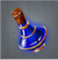

# Cover of Night (Tier 1 – Level 2)

**Duration:** 4 hours  
**Requirements:** None  
**Items:** 

  

    
    
Sleeping Potion

    
(Phase 1)

  

**Regens:** None  
**Drops:** None  
**Clan Unlock Bonus:**  
- Troop Attack: +0%  
- Troop Defense: +1%  
- Spy Attack: +0%  
- Spy Defense: +0%  

---

## 🧪 Battle Phases

### Phase 1:
- **Water Supply (24,000):** Item: Sleeping Potion  
- **Stray Guards (9,000):** Assassinate  
- **Treasure:** Steal to 0%

---

## 🧭 Strategy Tips

- Coordinate with clan members to ensure all tasks are completed efficiently.  

---

## ⚔️ Additional Notes

- **Difficulty:** Easy  
- **Rewards:** Gold
- **Previous Battle:** [Warbeasts](warbeasts.md)  
- **Next Battle:** [Kingdom Assault](kingdom-assault.md)
