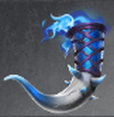

# To the Chamber (Tier 1 – Level 4)

**Duration:** 9 hours  
**Requirements:** None  
**Items:** 

  

    
    
Mist of Confusion

    
(Phase 1)

  

**Regens:** Guards of the Keep (Phase 2)  
**Drops:** 

  

    
    
Horn of Calydor

  

**Clan Unlock Bonus:** None

---

## 🧪 Battle Phases

### Phase 1:
- **Foot Soldiers (72,000):** Attack and Assassinate  
- **Soldiers Co-ordination (72,000):** Item: Mist of Confusion  
- **Keys Remaining:** Steal to 70%

### Phase 2:
- **Guards of the Keep (202,500):** Attack and Assassinate  
  *Guards regenerate every 5 minutes!*  
- **Keys Remaining:** Steal to 0%

---

## 🧭 Strategy Tips

- Assassinate works best on Guards of the Keep.  
- Keep some spies in assassination phases to steal on mainbar.

---

## ⚔️ Additional Notes

- **Difficulty:** Easy 
- **Rewards:** Gold, Horn of Calydor  
- **Previous Battle:** [Kingdom Assault](kingdom-assault.md)  
- **Next Battle:** [The Depraved](the-depraved.md)
