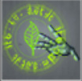
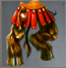
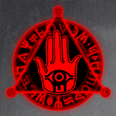

# The Reckoning (Tier 3 – Level 1)

**Duration:** 12 hours  
**Requirements:** None  
**Items:** 

  

    
    
Healing Aura

    
(Phase 2)

  

**Regens:** Massive Tentacles (Phase 2)  
**Drops:** 

  

    
    
Hooves of Destruction

    
(Equipment)

  

  

    
    
Seal of the Damned

  

**Clan Unlock Bonus:** None

---

## 🧪 Battle Phases

### Phase 1:
- **Sea of Tentacles (Port) (189,000):** Attack and Assassinate  
- **Sea of Tentacles (Starboard) (189,000):** Attack and Assassinate  
- **Head of Z'uthmerak:** Attack and Assassinate to 75%

### Phase 2:
- **Massive Tentacles (Port) (36,000):** Item: Healing Aura  
- **Massive Tentacles (Starboard) (36,000):** Item: Healing Aura  
  *Massive Tentacles regenerates 5% (1,800) every 2 minutes!*  
- **Head of Z'uthmerak:** Attack and Assassinate to 10%  
  *Keep Massive Tentacles at zero to avoid failed attacks!*

### Phase 3:
- **Head of Z'uthmerak:** Attack and Assassinate to 0%

---

## 🧭 Strategy Tips

- Use Healing Aura on Sea of Tentacles and Massive Tentacles, keep an eye on  regeneration.  
- Coordinate with clan members to efficiently complete tasks.  
- Prioritize attacking and assassinating Head of Z'uthmerak.

---

## ⚔️ Additional Notes

- **Difficulty:** Easy  
- **Rewards:** Gold, Seal of the Damned, Hooves of Destruction  
- **Previous Battle:** [The Forgotten Ones](the-forgotten-ones.md)  
- **Next Battle:** [Abandoned Kingdom](../tier3/abandoned-kingdom.md)