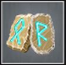

# No Man's Land (Tier 4 – Level 2)

**Duration:** 8 hours  
**Requirements:** None  
**Items:** 

  

    
    
Runes of Detection

    
(Phase 1)

  

**Regens:** Shield Spell (Phase 1)  
**Drops:** 

  

    
    
Hooves of Destruction

  

  

    
    
Leonine Arm Plate

  

**Clan Unlock Bonus:** None

---

## 🧪 Battle Phases

### Phase 1 of 2:
- **Shield Spell (15,000):** Item: Runes of Detection  
  *Shield Spell regenerates 150 points every 2 minutes!*  
- **Health:** Attack and Assassinate to 50%  
  *Keep Shield Spell at zero to avoid attack losses!*

### Phase 2 of 2:
- **Mountainous Terrain (280,000):** Scout  
- **Health:** Attack and Assassinate to 0%

---

## 🧭 Strategy Tips

- Coordinate with clan members to efficiently complete tasks.  
- Prioritize attacking and assassinating Health in Phase 1.

---

## ⚔️ Additional Notes

- **Difficulty:** Medium  
- **Rewards:** Gold, Hooves of Destruction, Leonine Arm Plate  
- **Previous Battle:** [Evanescence](evanescence.md)  
- **Next Battle:** [Ambush](ambush.md)
