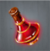
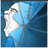
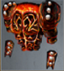

# The Destroyer (Tier 4 – Level 4)

**Duration:** 12 hours  
**Requirements:** None  
**Items:** 

  

    
    
Elixir of Rage

    
(Phase 2)

  

  

    
    
Elven Shield

    
(Phase 3)

  

  

    <!-- Bilder in einer Reihe -->
    

      
      
    

    
Elixir of Rage + Elven Shield

    
(Phase 4)

  

**Regens:** Smoldering Form (Phase 4)  
**Drops:** 

  

    
    
Locust Swarm

  

 

    
    
Mind Scream

  

  

    
    
Armor of Eternal Fire

    
(Equipment)

  
 

**Clan Unlock Bonus:** None

---

## 🧪 Battle Phases

### Phase 1 of 4:
- **Summoned Golems (20,000):** Attack and Assassinate  
- **Lifeforce:** Attack and Assassinate to 80%

### Phase 2 of 4:
- **Stoic Calm (10,000):** Item: Elixir of Rage  
  *Stoic Calm regenerates 500 points every 5 minutes!*  
- **Lifeforce:** Attack and Assassinate to 60%

### Phase 3 of 4:
- **Iron Titans (25,000):** Attack and Assassinate  
- **Intense Heat (20,000):** Item: Elven Shield  
  *Intense Heat regenerates 400 points every 5 minutes!*  
- **Lifeforce:** Attack and Assassinate to 40%

### Phase 4 of 4:
- **Summoned Golems (20,000):** Attack and Assassinate  
- **Iron Titans (25,000):** Attack and Assassinate  
- **Smoldering Form (40,000):** Items: Elixir of Rage & Elven Shield  
  *Smoldering Form regenerates 800 points every 5 minutes!*  
  *Keep Smoldering Form at zero to avoid failed attacks!*  
- **Lifeforce:** Attack and Assassinate to 0%

---

## 🧭 Strategy Tips

- Use Elixir of Rage on Stoic Calm.  
- Use Elven Shield on Intense Heat.  
- Use both Elixir of Rage and Elven Shield on Smoldering Form.  
- Coordinate with clan members to efficiently complete tasks.  
- Prioritize attacking and assassinating Lifeforce in each phase.

---

## ⚔️ Additional Notes

- **Difficulty:** Medium  
- **Rewards:** Gold, Locust Swarm, Mind Scream, Armor of Eternal Fire  
- **Previous Battle:** [Ambush](ambush.md)  
- **Next Battle:** [The Haunting](../tier5/the-haunting.md)
