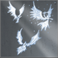
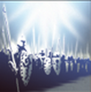
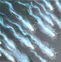
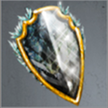

# City of the Dead (Tier 5 – Level 3)

**Duration:** 12 hours  
**Requirements:** None  
**Items:** 

  

    
    
Angels of Light

    
(Phase 1)

  

  

    
    
Seal of Divinity

    
(Phase 2)

  

  

    
    
Holy Wrath

    
(Phase 3)

  

**Regens:** Haze of Evil (Phase 1), Specters of the Accursed (Phase 3)  
**Drops:** 

  

    
    
Locust Swarm

  

 

    
    
Mind Scream

  

  

    
    
Ice Guardian's Shield

    
(Equipment)

  
 

**Clan Unlock Bonus:** None

---

## 🧪 Battle Phases

### Phase 1 of 3:
- **Haze of Evil (30,000):** Item: Angels of Light  
  *Haze of Evil regenerates 400 points every 10 minutes!*  
- **Army of the Undead (250,000):** Attack and Assassinate  
- **Pursuit:** Scout to 66%

### Phase 2 of 3:
- **Undead Guardians (40,000):** Item: Seal of Divinity  
- **Ghostly Artifacts (75,000):** Steal  
- **Army of the Undead (250,000):** Attack and Assassinate  
- **Pursuit:** Scout to 33%

### Phase 3 of 3:
- **Specters of the Accursed (50,000):** Item: Holy Wrath  
  *Specters of the Accursed regenerates 800 points every 10 minutes!*  
- **Friends of the Accursed (500,000):** Attack and Assassinate  
- **Pursuit:** Scout to 0%

---

## 🧭 Strategy Tips

- Use Angel of Light on Haze of Evil.  
- Use Seal of Divinity on Undead Guardians.  
- Use Holy Wrath on Specters of the Accursed.  
- Coordinate with clan members to efficiently complete tasks.  
- Prioritize attacking and assassinating Army of the Undead, Ghostly Artifacts, and Friends of the Accursed.

---

## ⚔️ Additional Notes

- **Difficulty:** Medium  
- **Rewards:** Gold, Locust Swarm, Mind Scream, Ice Guardian's Shield  
- **Previous Battle:** [No Quarter](no-quarter.md)  
- **Next Battle:** [Figure of Death](figure-of-death.md)
