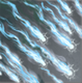
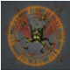
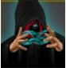

# Figure of Death (Tier 5 – Level 4)

**Duration:** 12 hours  
**Requirements:** None  
**Items:** 

  

    <!-- Bilder in einer Reihe -->
    

      
      
    

    
Angels of Light + Holy Wrath

    
(Phase 1 & 2; if told to: Phase 3)

  

  

    
    
Locust Swarm

    
(Phase 2; if told to: Phase 3)

  

 
**Regens:** Haze of the Accursed (Phase 1, 2 & 3), Forests of Corruption (Phase 3)  
**Drops:** 

  

    
    
Blizzard

  

 

    
    
Amnesia

  

  

    
    
Abyssal Blade

  

  

    
    
Diamondiferous

  

**Clan Unlock Bonus:** None

---

## 🧪 Battle Phases

### Phase 1 of 3:
- **Haze of the Accursed (30,000):** Items: Angels of Light & Holy Wrath  
  *Haze of the Accursed regenerates 600 points every 10 minutes!*  
- **Life:** Attack and Assassinate to 75%

### Phase 2 of 3:
- **Haze of the Accursed (30,000):** Items: Angel of Light & Holy Wrath  
  *Haze of the Accursed regenerates 600 points every 5 minutes!*  
- **Forests of Corruption (10,000):** Item: Locust Swarm  
- **Life:** Attack and Assassinate to 50%

### Phase 3 of 3:
- **Corrupt Guardians (500,000):** Attack and Assassinate  
- **Life:** Attack and Assassinate to 3%

---

## 🧭 Strategy Tips

- **"God Mode" Testing:**  
  After reducing Life to 3%, you may enter a phase where your actions have no effect, known as "God Mode." This lasts approximately 5 to 8 minutes and repeats every 5 to 8 minutes. During this time, refrain from using items unless instructed. To identify the optimal timing ("sweet spot") for your attacks:

  1. Use Angel of Light & Holy Wrath together 12 times and Locust Swarm 8 times. (When bar is full: AoL + HW 8 times, LS 5 times)
  2. Attempt to attack or assassinate Life.
  3. If unsuccessful, repeat step 1.
  4. Once successful, you have found the "sweet spot."
  5. Maintain this timing until the Epic Battle is complete.

  *Note:* If you overuse any item, you will need to wait for it to regenerate, which may reset the phase.

---

## ⚔️ Additional Notes

- **Difficulty:** Medium  
- **Rewards:** Gold, Blizzard, Amnesia, Aqua, Inferno, King's Tomb, Abyssal Blade, Diamondiferous  
- **Previous Battle:** [City of the Dead](city-of-the-dead.md)  
- **Next Battle:** [Haunting: The Escape](haunting-the-escape.md)
