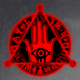
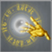

# Haunting: The Escape (Tier 5 - Premium)

**Duration:** 6 hours  
**Requirements:** None  
**Items:** 

  

    
    
Seal of the Damned

    
(Phase 1)

  

  

    
    
Seal of Deflection

    
(Phase 1 & 2)

  

**Regens:** None  
**Drops:** 

  

    
    
Aqua

  

 

    
    
Inferno

  

  

    
    
Horn of Calydor

  

**Clan Unlock Bonus:** None

---

## 🧪 Battle Phases

### Phase 1 of 2:
- **Unholy Rift:** Item: Seal of the Damned  
  *Only ONE member of your clan needs to use this item!*  
- **Souls of the Damned (94,500):** Attack and Assassinate  
- **Skeletal Apparitions (94,500):** Attack and Assassinate  
- **Seal of the Dead:** Item: Seal of Deflection to 50%

### Phase 2 of 2:
- **Reanimated Corpses (283,500):** Attack and Assassinate  
- **Seal of the Dead:** Item: Seal of Deflection to 0%

---

## 🧭 Strategy Tips

- **Seal of the Damned:** Only ONE member of your clan needs to use this item in Phase 1.  
- **Seal of Deflection:** Use on Seal of the Dead in both phases  
- Coordinate with clan members to efficiently complete tasks.  
- Prioritize attacking and assassinating Souls of the Damned, Skeletal Apparitions, and Reanimated Corpses.

---

## ⚔️ Additional Notes

- **Difficulty:** Medium  
- **Rewards:** Gold, Aqua, Inferno, Horn of Calydor  
- **Previous Battle:** [Figure of Death](figure-of-death.md)  
- **Next Battle:** [Talons of Carnage](../tier6/talons-of-carnage.md)
