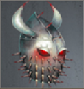
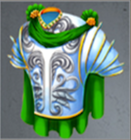

# No Quarter (Tier 5 – Level 2)

**Duration:** 12 hours  
**Requirements:** None  
**Items:** 

  

    
    
Seal of Deflection

    
(Phase 2, 3 & 4)

  

  

    
    
Seal of Lightning

    
(Phase 4)

  

**Regens:** Apheriun's Seal (Phase 2), Apheriun's Improved Seal (Phase 3 & 4), Seal of the Nether (Phase 4)  
**Drops:** 

  

    
    
Hystricidae Helmet

  

  

    
    
Nether Realm Breastplate

  

**Clan Unlock Bonus:** None

---

## 🧪 Battle Phases

### Phase 1:
- **Apheriun:** Attack and Assassinate to 90%

### Phase 2:
- **Legions of the Nether (130,000):** Attack and Assassinate  
- **Nether Beasts (105,000):** Scout
- **Apheriun's Seal (15,000):** Item: Seal of Deflection  
  *Apheriun's Seal regenerates 450 points every 5 minutes!*  
- **Apheriun:** Attack and Assassinate to 70%  
  *Keep Apheriun's Seal at zero to avoid failed attacks!*

### Phase 3:
- **Apheriun's Improved Seal (15,000):** Item: Seal of Deflection  
  *Keep Apheriun's Improved Seal between 6,750 and 8,250 (roughly 45%–55%) to avoid failed attacks!*  
  *Apheriun's Improved Seal regenerates 450 points every 2 minutes!*  
- **Apheriun:** Attack and Assassinate to 20%  
  *Maintain Apheriun's Improved Seal within the specified range!*

### Phase 4:
- **Apheriun's Improved Seal (15,000):** Item: Seal of Deflection  
  *Keep Apheriun's Improved Seal between 6,750 and 8,250 (roughly 45%–55%) to avoid failed attacks!*  
  *Apheriun's Improved Seal regenerates 450 points every 2 minutes!*  
- **Seal of the Nether (30,000):** Item: Seal of Lightning  
  *Seal of the Nether regenerates 1,000 points every 2 minutes!*  
  *Test to find the "sweet spot" for attacking Apheriun every 1,000–2,000 points; the optimal range is approximately 3,000 points wide.*  
- **Apheriun:** Attack and Assassinate to 0%  
  *Coordinate with clan members to maintain both seals and attack Apheriun effectively!*

---

## 🧭 Strategy Tips

- Use Seal of Deflection on Apheriun's Seal in Phase 2.  
- Use Seal of Deflection on Apheriun's Improved Seal in Phases 3 and 4.  
- Use Seal of Lightning on Seal of the Nether in Phase 4.
- Make out one person to take over the items in Phase 4.
- Coordinate with clan members to maintain the specified ranges for Apheriun's seals.  
- Prioritize attacking and assassinating Apheriun while managing the seals.

---

## ⚔️ Additional Notes

- **Difficulty:** Medium  
- **Rewards:** Gold, Hystricidae Helmet, Nether Realm Breastplate  
- **Previous Battle:** [The Haunting](the-haunting.md)  
- **Next Battle:** [City of the Dead](city-of-the-dead.md)
