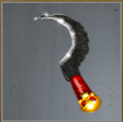

# New Growth (Tier 6 – Level 2)

**Duration:** 8 hours  
**Requirements:** None  
**Items:** 

  

    
    
Elven Shield

    
(Phase 1)

  

 
**Regens:** Toxic Shoots (Phase 2)  
**Drops:** 

  

    
    
Locust Swarm

  

 

    
    
Mind Scream

  

  

    
    
Searing Sickle

    
(Equipment)

  
 

**Clan Unlock Bonus:** None

---

## 🧪 Battle Phases

### Phase 1 of 2:
- **Deadly Spores (45,000):** Item: Elven Shield  
- **Poison Seed Swarm:** Attack to 90%

### Phase 2 of 2:
- **Toxic Shoots (120,000):** Assassinate  
  *Toxic Shoots regenerates 1,200 points every 6 minutes!*  
- **Poison Seed Swarm:** Attack to 0%

---

## 🧭 Strategy Tips

- Use Elven Shield on Deadly Spores.  
- Focus on Assassinating Toxic Shoots quickly because of the regeneration.  
- Attack Poison Seed Swarm down in each phase as outlined.

---

## ⚔️ Additional Notes

- **Difficulty:** Medium  
- **Rewards:** Gold, Locust Swarm, Mind Scream, **Searing Sickle** (required in [Scionic Storm](scionic-storm.md))  
- **Previous Battle:** [Talons of Carnage](talons-of-carnage.md)  
- **Next Battle:** [Scionic Storm](scionic-storm.md)
