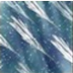
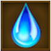
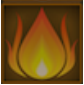
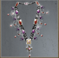

# Scionic Storm (Tier 6 – Level 3)

**Duration:** 10 hours  
**Requirements:** 

  

    
    
Searing Sickle

    
(Phase 2)

  
 

**Items:** 

  

    
    
Orb of Illumination

    
(Phase 3)

  
 

**Regens:** Pupal Form (Phase 2)  
**Drops:** 

  

    
    
Blizzard

  

 

    
    
Amnesia

  

  

    
    
Aqua

  

 

    
    
Inferno

  

  

    
    
Torrent Talisman

    
(Equipment)

  

**Clan Unlock Bonus:** None

---

## 🧪 Battle Phases

### Phase 1 of 3:
- **Oozing Bane (100,000):** Attack and Assassinate  
- **Children of the Pod:** Attack and Assassinate to 90%

### Phase 2 of 3:
- **Pupal Form (27,000):** Attack and Assassinate  
  *Pupal Form regenerates 8,100 points every 10 minutes!*  
  *Must have **Searing Sickle** equipped to hit!*
- **Children of the Pod:** Attack and Assassinate to 50%

### Phase 3 of 3:
- **Podlings (45,000):** Item: Orb of Illumination  
- **Children of the Pod:** Attack and Assassinate to 0%

---

## 🧭 Strategy Tips

- Use Orb of Illumination on Podlings.  
- Equip Searing Sickle for Phase 2 to hit Pupal Form.  
- Prioritize attacking and assassinating Oozing Bane and Pupal Form.  
- Bring Children of the Pod down in stages across all phases.

---

## ⚔️ Additional Notes

- **Difficulty:** Hard  
- **Rewards:** Gold, Blizzard, Amnesia, Aqua, Inferno, **Torrent Talisman** (required in [Sporavek's Revenge](sporaveks-revenge.md))  
- **Previous Battle:** [New Growth](new-growth.md)  
- **Next Battle:** [Sporavek’s Revenge](sporaveks-revenge.md)
