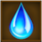

# Sporavek’s Revenge (Tier 6 – Level 4)

**Duration:** 12 hours  
**Requirements:** 

  

    
    
Fog of War (Spell)

    
(Phase 3)

  

 

    
    
Battle Fury (Spell)

    
(Phase 3)

  

  

    
    
Abyssal Blade

    
(Equipment)

    
(Phase 4)

  

  

    
    
Torrent Talisman

    
(Equipment)

    
(Phase 4)

  
  

**Items:** 

  

    
    
Chalice of Life

    
(Phase 1)

  

  

    
    
Seal of Deflection

    
(Phase 2)

  

**Regens:**  
- Infected Soldiers (Phase 2)  
- Steel Talons (Phase 4)  
- Metallic Roots (Phase 4)  
- Cavernous Mouth (Phase 4)  
**Drops:** 

  

    
    
Blizzard

  

  

    
    
Amnesia

  

  

    
    
Aqua

  

  

    
    
Inferno

  

  

    
    
Iron Gauntlets

    
(Equipment)

  

  

    
    
Pinioned Boots

    
(Equipment)

  

**Clan Unlock Bonus:** None

---

## 🧪 Battle Phases

### Phase 1 of 4:
- **Rain of Stahl (45,000):** Item: Chalice of Life  
- **Sporavek the Sylvan:** Attack and Assassinate to 80%

### Phase 2 of 4:
- **Lethal Contagion (24,000):** Item: Seal of Deflection  
- **Infected Soldiers (120,000):** Attack and Assassinate (*regenerates!*)  
- **Sporavek the Sylvan:** Attack and Assassinate to 60%

### Phase 3 of 4:
- **Piercing Barbs (500,000):** Attack and Assassinate (*must have Battle Fury active*)  
- **Spiked Tendrils (360,000):** Assassinate (*must have Fog of War active*)  
- **Sporavek the Sylvan:** Attack and Assassinate to 25%

### Phase 4 of 4:
- **Steel Tendrils (60,000):** Attack and Assassinate (*must have Abyssal Blade equipped; regenerates 600 points every 5 min*)  
- **Metallic Roots (185,000):** Attack and Assassinate (*regenerates 5,500 points every 5 min*)  
- **Cavernous Mouth (25,000):** Attack and Assassinate (*must have Torrent Talisman equipped*)  
- **Sporavek the Sylvan:** Attack and Assassinate to 0%

---

## 🧭 Strategy Tips

- Use Chalice of Life on Rain of Stahl in Phase 1.  
- Use Seal of Deflection on Lethal Contagion in Phase 2.  
- Ensure you have **Battle Fury** and **Fog of War** active in Phase 3 to be able to hit the respective bars.  
- Have **Abyssal Sword** and **Torrent Talisman** equipped in Phase 4 to reach Steel Talons and Cavernous Mouth.  
- Prioritize handling regenerating bars quickly to prevent stalling progress.

---

## ⚔️ Additional Notes

- **Difficulty:** Hard  
- **Rewards:** Gold, Blizzard, Amnesia, Aqua, Inferno, Seal of the Damned, Iron Gauntlets, Pinioned Boots  
- **Previous Battle:** [Scionic Storm](scionic-storm.md)  
- **Next Battle:** [The Barren Orchard](../tier7/the-barren-orchard)
