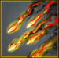
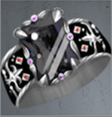
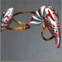

# Talons of Carnage (Tier 6 – Level 1)

**Duration:** 8 hours  
**Requirements:** None  
**Items:** 

  

    
    
Rain of Fire

    
(Phase 1 & 2)

  

**Regens:** Demonic Talons (Phase 2)  
**Drops:** 

  

    
    
Silica Ring of Silence

    
(Equipment)

  

  

    
    
Quicksilver Plates

    
(Equipment)

  

**Clan Unlock Bonus:** None

---

## 🧪 Battle Phases

### Phase 1 of 2:
- **Roots of Destruction (250,000):** Attack and Assassinate  
- **Wretched Claws:** Item: Rain of Fire (to 50%)  

### Phase 2 of 2:
- **Demonic Talons (500,000):** Attack and Assassinate  
  *Demonic Talons regenerates 5,000 points every 2.5 minutes!*  
- **Wretched Claws:** Item: Rain of Fire (to 0%)  

---

## 🧭 Strategy Tips

- Use Rain of Fire on Wretched Claws.  
- Focus clan attacks on Demonic Talons due to regeneration.  
- Coordinate with clan members to efficiently complete tasks.  

---

## ⚔️ Additional Notes

- **Difficulty:** Medium  
- **Rewards:** Gold, Silica Ring of Silence, Quicksilver Plates  
- **Previous Battle:** [Haunting: The Escape](../tier5/haunting-the-escape.md)  
- **Next Battle:** [New Growth](new-growth.md)
