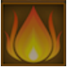

# Terrain Travails (Tier 7 – Level 2)

**Duration:** 14 hours  
**Requirements:** None  
**Items:** None  
**Regens:** Wyvern (Phase 1), Vengeful Wyvern (Phase 2)  
**Drops:** 

  

    
    
Aqua

  

  

    
    
Inferno

  

  

    
    
Aureate Bracer

    
(Equipment)

  

  

    
    
Viridescent Shield

    
(Equipment)

  

**Clan Unlock Bonus:** None

---

## 🧪 Battle Phases

### Phase 1 of 2:
- **Wyvern (1,032,000):** Attack and Assassinate  
  *Wyvern regenerates 103,000 points every 60 minutes!*  
- **The Vermeil Mountain:** Scout to 50%

### Phase 2 of 2:
- **Cliffs of Vermillion (1,376,000):** Attack and Assassinate  
  *Cliffs of Vermillion regenerates 207,000 points every 60 minutes!*  
- **The Vermeil Mountain:** Scout to 0%

---

## 🧭 Strategy Tips

- Focus on Wyvern in Phase 1 to prevent excessive regeneration.  
- Use Assassinate on Cliffs of Vermillion in Phase 2 to manage regen.  
- Prioritize scouting The Vermeil Mountain to 50% in Phase 1 and to 0% in Phase 2.

---

## ⚔️ Additional Notes

- **Difficulty:** Hard  
- **Rewards:** Gold, Aqua, Inferno, Aureate Bracer, Viridescent Shield  
- **Previous Battle:** [The Barren Orchard](the-barren-orchard.md)  
- **Next Battle:** [Crossing the Threshold](crossing-the-threshold.md)
