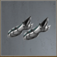
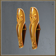

# The Barren Orchard (Tier 7 – Level 1)

**Duration:** 6 hours  
**Requirements:** None  
**Items:** None  
**Regens:** Morning Star (Phase 2), The Barren Orchard (Phase 2)  
**Drops:** 

  

    
    
Aqua

  

  

    
    
Inferno

  

  

    
    
Steadfast Sollerets

    
(Equipment)

  

  

    
    
Gold-Plated Greaves

    
(Equipment)

  

**Clan Unlock Bonus:** None

---

## 🧪 Battle Phases

### Phase 1 of 2:
- **Enslaved Farmers (78,000):** Scout  
- **The Barren Orchard:** Attack and Assassinate to 75%

### Phase 2 of 2:
- **Morning Star (7,200):** Assassinate  
  *Morning Star regenerates to full every 30 minutes!*  
- **The Barren Orchard:** Attack and Assassinate to 0%  
  *The Barren Orchard regenerates 25% every 30 minutes!*

---

## 🧭 Strategy Tips

- Use Scout on Enslaved Farmers to gather intel.  
- Focus on bringing down The Barren Orchard in stages across both phases.  
- Manage Morning Star's regen by timing your Assassinations carefully.

---

## ⚔️ Additional Notes

- **Difficulty:** Moderate  
- **Rewards:** Gold, Aqua, Inferno, Steadfast Sollerets, Gold-Plated Greaves  
- **Previous Battle:** [Sporavek’s Revenge](../tier6/sporaveks-revenge.md)  
- **Next Battle:** [Terrain Travails](terrain-travails.md)
