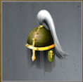
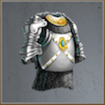

# The Cave of Riches (Tier 7 – Level 4)

**Duration:** 12 hours  
**Requirements:** 

  

    
    
Stalwart Helmet

    
(Equipment)

    
(Phase 4)

  

**Items:** None  
**Regens:** Squire (Phase 4)  
**Drops:** 

  

    
    
Aqua

  

  

    
    
Inferno

  

  

    
    
Vermeil Breastplate

    
(Equipment)

  

**Clan Unlock Bonus:** None

---

## 🧪 Battle Phases

### Phase 1 of 4:
- **Mechanized Bird (72,000):** Assassinate  
- **Treasure Chamber:** Steal to 75%

### Phase 2 of 4:
- **Persistent Sellsword (344,000):** Attack and Assassinate  
- **Treasure Chamber:** Steal to 50%

### Phase 3 of 4:
- **Deranged Thief (258,000):** Attack and Assassinate  
- **Treasure Chamber:** Steal to 25%

### Phase 4 of 4:
- **Squire (172,000):** Attack and Assassinate  
  *Squire regenerates every 15 minutes!*  
- **Damascus the Proud (516,000):** Attack and Assassinate  
  *Must have **Stalwart Helmet** equipped to hit!*  
- **Treasure Chamber:** Steal to 0%

---

## 🧭 Strategy Tips

- Equip **Stalwart Helmet** to hit **Damascus the Proud**.  
- Prioritize attacking and assassinating **Persistent Sellsword** and **Deranged Thief**.  
- Steal from **Treasure Chamber** in stages across all phases.  
- Manage **Squire's** regeneration by timing your attacks carefully.

---

## ⚔️ Additional Notes

- **Difficulty:** Hard  
- **Rewards:** Gold, Aqua, Inferno, **Vermeil Breastplate**  
- **Previous Battle:** [Crossing the Threshold](crossing-the-threshold.md)  
- **Next Battle:** [The Gilded Lord](the-gilded-lord.md)
