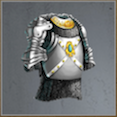
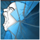

# The Gilded Lord (Tier 7 – Level 5)

**Duration:** 16 hours  
**Requirements:** 

  

    
    
Vermeil Breastplate

    
(Equipment)

    
(Phase 3)

  

**Items:** 

  

    
    
Angels of Light

    
(Phase 1)

  

  

    
    
Summon Darkness

    
(Phase 2)

  

 

    
    
Holy Wrath

    
(Phase 4)

  

  

    
    
Seal of Divinity

    
(Phase 4)

  

**Regens:** Spaded Tail (Phase 1), Golden Apple (Phase 2), Cyan Blast (Phase 3), Leathered Wings (Phase 4)  
**Drops:** 

  

    
    
Locust Swarm

  

  

    
    
Mind Scream

  

  

    
    
Blizzard

  

  

    
    
Amnesia

  

  

    
    
Seal of the Damned

  

  

    
    
Aqua

  

  

    
    
Inferno

  

  

    
    
Electric Storm Bow

    
(Equipment)

  

  

    
    
Enchanted Snare Ring

    
(Equipment)

  

  

    
    
Crown of Virtue

    
(Equipment)

  

**Clan Unlock Bonus:** None

---

## 🧪 Battle Phases

### Phase 1 of 4:
- **Golden Scales (86,000):** Use Angels of Light  
- **Spaded Tail (36,000):** Assassinate  
  *Spaded Tail regenerates 1,500 points every 5 minutes!*  
- **Moutos the Malevolent:** Attack and Assassinate to 75%

### Phase 2 of 4:
- **Sight of the Dragon (86,000):** Use Summon Darkness  
- **Flailing Talons (86,000):** Attack and Assassinate  
- **Golden Apple (172,000):** Attack and Assassinate  
  *Golden Apple regenerates 8,600 points every 15 minutes!*  
- **Moutos the Malevolent:** Attack and Assassinate to 50%

### Phase 3 of 4:
- **Serrated Teeth (78,000):** Scout  
- **Toxic Tongue (86,000):** Attack and Assassinate  
- **Cyan Blast (172,000):** Attack and Assassinate  
  *Must have **Vermeil Breastplate** equipped to hit!*  
  *Cyan Blast regenerates 17,200 points every 15 minutes!*  
- **Moutos the Malevolent:** Attack and Assassinate to 25%

### Phase 4 of 4:
- **Wind Tunnel (86,000):** Use Holy Wrath  
- **Violent Winds (86,000):** Use Seal of Divinity  
- **Leathered Wings (516,000):** Attack and Assassinate  
  *Leathered Wings regenerates 51,600 points every 30 minutes!*  
- **Moutos the Malevolent:** Attack and Assassinate to 0%

---

## 🧭 Strategy Tips

- Equip **Vermeil Breastplate** to hit **Cyan Blast**.  
- Use **Angels of Light** on **Golden Scales** in Phase 1.  
- Use **Summon Darkness** on **Sight of the Dragon** in Phase 2.  
- Use **Holy Wrath** on **Wind Tunnel** and **Seal of Divinity** on **Violent Winds** in Phase 4.  
- Prioritize attacking and assassinating **Moutos the Malevolent** across all phases.  
- Manage regenerations by timing your attacks carefully.

---

## ⚔️ Additional Notes

- **Difficulty:** Very Hard  
- **Rewards:** Gold, Aqua, Inferno, Electric Storm Bow, Enchanted Snare Ring, Crown of Virtue  
- **Previous Battle:** [The Cave of Riches](the-cave-of-riches.md)  
- **Next Battle:** [Storm the Palace](storm-the-palace.md)
